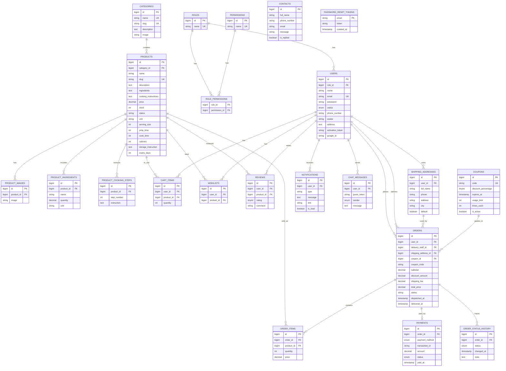
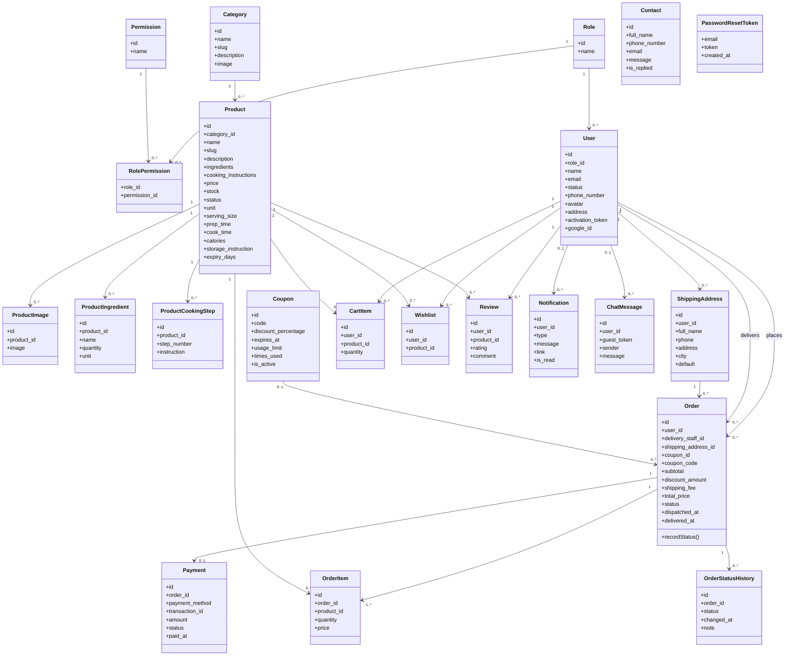

# Du lieu ve bieu do 3NF va mo hinh quan he

Nguon doi chieu: `database/migrations`, `app/Models`, `database/seeders`.

## 1. Tong quan he thong

He thong Meal-kit gom cac nhom du lieu:

- Phan quyen: `roles`, `permissions`, `role_permissions`, `users`.
- Danh muc va san pham: `categories`, `products`, `product_images`, `product_ingredients`, `product_cooking_steps`.
- Gio hang va mua hang: `cart_items`, `orders`, `order_items`, `payments`, `shipping_addresses`.
- Khuyen mai va giao hang: `coupons`, `order_status_history`, `delivery_staff_id` trong `orders`.
- Tuong tac khach hang: `reviews`, `wishlists`, `contacts`, `notifications`, `chat_messages`.
- Xac thuc: `password_reset_tokens`.

## 2. Tu dien du lieu

### roles

| Cot | Kieu | Rang buoc |
| --- | --- | --- |
| id | bigint | PK |
| name | string | unique, not null |
| created_at, updated_at | timestamp | nullable |

Seed: `admin`, `staff`, `delivery_staff`, `customer`.

### permissions

| Cot | Kieu | Rang buoc |
| --- | --- | --- |
| id | bigint | PK |
| name | string | unique, not null |
| created_at, updated_at | timestamp | nullable |

Seed: `manage_users`, `manage_products`, `manage_orders`, `manage_categories`, `manage_contacts`, `manage_deliveries`, `manage_coupons`.

### role_permissions

| Cot | Kieu | Rang buoc |
| --- | --- | --- |
| role_id | bigint | FK -> roles.id, cascade delete |
| permission_id | bigint | FK -> permissions.id, cascade delete |
| created_at, updated_at | timestamp | nullable |

Ghi chu 3NF: nen ve PK ghep `(role_id, permission_id)`. Migration hien tai chua khai bao PK/unique cho bang trung gian nay.

### users

| Cot | Kieu | Rang buoc |
| --- | --- | --- |
| id | bigint | PK |
| name | string | not null |
| email | string | unique, not null |
| password | string | not null |
| status | enum | `pending`, `active`, `banned`, `deleted`; default `pending` |
| phone_number | string | nullable |
| avatar | string | nullable |
| address | text | nullable |
| role_id | bigint | FK -> roles.id, cascade delete |
| activation_token | string | nullable |
| google_id | string | nullable |
| created_at, updated_at | timestamp | nullable |

Seed mau: admin/staff/delivery va 3 user mau trong seeders.

### categories

| Cot | Kieu | Rang buoc |
| --- | --- | --- |
| id | bigint | PK |
| name | string | unique, not null |
| slug | string | unique, not null |
| description | text | nullable |
| image | string | nullable |
| created_at, updated_at | timestamp | nullable |

Seed danh muc meal-kit: Mon gia dinh, Eat clean, Mon nhanh 15 phut, Lau/Nuong, Combo tiet kiem.

### products

| Cot | Kieu | Rang buoc |
| --- | --- | --- |
| id | bigint | PK |
| name | string | not null |
| slug | string | unique, not null |
| category_id | bigint | FK -> categories.id, cascade delete |
| description | text | nullable |
| ingredients | text | nullable |
| cooking_instructions | text | nullable |
| price | decimal(10,2) | not null |
| stock | integer | default 0 |
| status | string | default `in_stock` |
| unit | string | nullable |
| serving_size | unsigned small integer | nullable |
| prep_time | unsigned small integer | nullable, phut |
| cook_time | unsigned small integer | nullable, phut |
| calories | unsigned small integer | nullable |
| storage_instruction | text | nullable |
| expiry_days | unsigned small integer | nullable |
| created_at, updated_at | timestamp | nullable |

Ghi chu: `ingredients` va `cooking_instructions` duoc giu de tuong thich du lieu cu; du lieu meal-kit chuan hoa dung `product_ingredients` va `product_cooking_steps`.

### product_ingredients

| Cot | Kieu | Rang buoc |
| --- | --- | --- |
| id | bigint | PK |
| product_id | bigint | FK -> products.id, cascade delete |
| name | string | not null |
| quantity | decimal(8,2) | nullable |
| unit | string(50) | nullable |
| created_at, updated_at | timestamp | nullable |

### product_cooking_steps

| Cot | Kieu | Rang buoc |
| --- | --- | --- |
| id | bigint | PK |
| product_id | bigint | FK -> products.id, cascade delete |
| step_number | unsigned small integer | not null |
| instruction | text | not null |
| created_at, updated_at | timestamp | nullable |

Rang buoc unique: `(product_id, step_number)`.

### product_images

| Cot | Kieu | Rang buoc |
| --- | --- | --- |
| id | bigint | PK |
| product_id | bigint | FK -> products.id, cascade delete |
| image | string | nullable |
| created_at, updated_at | timestamp | nullable |

### shipping_addresses

| Cot | Kieu | Rang buoc |
| --- | --- | --- |
| id | bigint | PK |
| user_id | bigint | FK -> users.id, cascade delete |
| full_name | string | not null |
| phone | string | not null |
| address | string | not null |
| city | string | not null |
| default | boolean | default false |
| created_at, updated_at | timestamp | nullable |

### orders

| Cot | Kieu | Rang buoc |
| --- | --- | --- |
| id | bigint | PK |
| user_id | bigint | FK -> users.id, cascade delete |
| delivery_staff_id | bigint | nullable, FK -> users.id, null on delete |
| subtotal | decimal(10,2) | default 0 |
| discount_amount | decimal(10,2) | default 0 |
| shipping_fee | decimal(10,2) | default 0 |
| coupon_id | bigint | nullable, FK -> coupons.id, null on delete |
| coupon_code | string | nullable |
| total_price | decimal(10,2) | not null |
| status | string | default `pending` |
| dispatched_at | timestamp | nullable |
| delivered_at | timestamp | nullable |
| shipping_address_id | bigint | FK -> shipping_addresses.id, cascade delete |
| created_at, updated_at | timestamp | nullable |

Status trong model: `pending`, `processing`, `packed`, `ready_for_delivery`, `out_for_delivery`, `delivered`, `completed`, `canceled`.

### order_items

| Cot | Kieu | Rang buoc |
| --- | --- | --- |
| id | bigint | PK |
| order_id | bigint | FK -> orders.id, cascade delete |
| product_id | bigint | FK -> products.id, cascade delete |
| quantity | integer | not null |
| price | decimal(10,2) | gia tai thoi diem mua |
| created_at, updated_at | timestamp | nullable |

### payments

| Cot | Kieu | Rang buoc |
| --- | --- | --- |
| id | bigint | PK |
| order_id | bigint | FK -> orders.id, cascade delete |
| payment_method | enum | `cash`, `paypal`, `vietqr` |
| transaction_id | string | nullable |
| amount | decimal(10,2) | not null |
| status | enum | `pending`, `completed`, `failed`; default `pending` |
| paid_at | timestamp | nullable |
| created_at, updated_at | timestamp | nullable |

### coupons

| Cot | Kieu | Rang buoc |
| --- | --- | --- |
| id | bigint | PK |
| code | string | unique, not null |
| discount_percentage | unsigned tinyint | not null |
| expires_at | timestamp | nullable |
| usage_limit | unsigned integer | nullable |
| times_used | unsigned integer | default 0 |
| is_active | boolean | default true |
| created_at, updated_at | timestamp | nullable |

### order_status_history

| Cot | Kieu | Rang buoc |
| --- | --- | --- |
| id | bigint | PK |
| order_id | bigint | FK -> orders.id, cascade delete |
| status | enum | `pending`, `processing`, `packed`, `ready_for_delivery`, `out_for_delivery`, `delivered`, `completed`, `canceled` |
| changed_at | timestamp | default current timestamp |
| note | text | nullable |
| created_at, updated_at | timestamp | nullable |

### cart_items

| Cot | Kieu | Rang buoc |
| --- | --- | --- |
| id | bigint | PK |
| user_id | bigint | FK -> users.id, cascade delete |
| product_id | bigint | FK -> products.id, cascade delete |
| quantity | integer | not null |
| created_at, updated_at | timestamp | nullable |

Ghi chu: nen them unique `(user_id, product_id)` de moi san pham chi co mot dong trong gio hang.

### wishlists

| Cot | Kieu | Rang buoc |
| --- | --- | --- |
| id | bigint | PK |
| user_id | bigint | FK -> users.id, cascade delete |
| product_id | bigint | FK -> products.id, cascade delete |
| created_at, updated_at | timestamp | nullable |

Ghi chu: nen them unique `(user_id, product_id)`.

### reviews

| Cot | Kieu | Rang buoc |
| --- | --- | --- |
| id | bigint | PK |
| user_id | bigint | FK -> users.id, cascade delete |
| product_id | bigint | FK -> products.id, cascade delete |
| rating | unsigned tinyint | not null |
| comment | string | nullable |
| created_at, updated_at | timestamp | nullable |

Ghi chu: neu moi user chi duoc danh gia 1 lan/san pham, nen them unique `(user_id, product_id)`.

### notifications

| Cot | Kieu | Rang buoc |
| --- | --- | --- |
| id | bigint | PK |
| user_id | bigint | nullable, FK -> users.id, cascade delete |
| type | string(50) | not null |
| message | text | not null |
| link | string | nullable |
| is_read | boolean | default false |
| created_at, updated_at | timestamp | nullable |

### contacts

| Cot | Kieu | Rang buoc |
| --- | --- | --- |
| id | bigint | PK |
| full_name | string | not null |
| phone_number | string | nullable |
| email | string | nullable |
| message | string | not null |
| is_replied | boolean | default false |
| created_at, updated_at | timestamp | nullable |

Ghi chu code: migration dung `is_replied`, model `Contact` dang fillable `isReply`; nen sua ve `is_replied` neu cap nhat bang form.

### chat_messages

| Cot | Kieu | Rang buoc |
| --- | --- | --- |
| id | bigint | PK |
| user_id | bigint | nullable, FK -> users.id, cascade delete |
| guest_token | string(100) | nullable, index |
| sender | enum | `user`, `bot`; default `user` |
| message | text | not null |
| created_at, updated_at | timestamp | nullable |

### password_reset_tokens

| Cot | Kieu | Rang buoc |
| --- | --- | --- |
| email | string | PK |
| token | string | not null |
| created_at | timestamp | nullable |

## 3. Quan he chinh

| Quan he | Luc luong |
| --- | --- |
| Role - User | 1 - N |
| Role - Permission | N - N qua `role_permissions` |
| Category - Product | 1 - N |
| Product - ProductImage | 1 - N |
| User - ShippingAddress | 1 - N |
| User - Order | 1 - N |
| User(delivery_staff) - Order | 1 - N, nullable |
| ShippingAddress - Order | 1 - N |
| Coupon - Order | 1 - N, nullable |
| Order - OrderItem | 1 - N |
| Product - OrderItem | 1 - N |
| Order - Payment | 1 - 0..1 |
| Order - OrderStatusHistory | 1 - N |
| User - CartItem - Product | User N-N Product qua `cart_items` |
| User - Wishlist - Product | User N-N Product qua `wishlists` |
| User - Review - Product | User N-N Product qua `reviews` |
| User - Notification | 1 - N, nullable |
| User - ChatMessage | 1 - N, nullable |

## 4. Mo hinh quan he dang ky hieu PK/FK

```text
ROLES(id PK, name UQ, created_at, updated_at)
PERMISSIONS(id PK, name UQ, created_at, updated_at)
ROLE_PERMISSIONS(role_id PK/FK, permission_id PK/FK, created_at, updated_at)

USERS(id PK, role_id FK, name, email UQ, password, status, phone_number, avatar, address, activation_token, google_id, created_at, updated_at)

CATEGORIES(id PK, name UQ, slug UQ, description, image, created_at, updated_at)
PRODUCTS(id PK, category_id FK, name, slug UQ, description, ingredients, cooking_instructions, price, stock, status, unit, serving_size, prep_time, cook_time, calories, storage_instruction, expiry_days, created_at, updated_at)
PRODUCT_IMAGES(id PK, product_id FK, image, created_at, updated_at)
PRODUCT_INGREDIENTS(id PK, product_id FK, name, quantity, unit, created_at, updated_at)
PRODUCT_COOKING_STEPS(id PK, product_id FK, step_number, instruction, created_at, updated_at)

SHIPPING_ADDRESSES(id PK, user_id FK, full_name, phone, address, city, default, created_at, updated_at)
COUPONS(id PK, code UQ, discount_percentage, expires_at, usage_limit, times_used, is_active, created_at, updated_at)
ORDERS(id PK, user_id FK, delivery_staff_id FK NULL, shipping_address_id FK, coupon_id FK NULL, coupon_code, subtotal, discount_amount, shipping_fee, total_price, status, dispatched_at, delivered_at, created_at, updated_at)
ORDER_ITEMS(id PK, order_id FK, product_id FK, quantity, price, created_at, updated_at)
PAYMENTS(id PK, order_id FK, payment_method, transaction_id, amount, status, paid_at, created_at, updated_at)
ORDER_STATUS_HISTORY(id PK, order_id FK, status, changed_at, note, created_at, updated_at)

CART_ITEMS(id PK, user_id FK, product_id FK, quantity, created_at, updated_at)
WISHLISTS(id PK, user_id FK, product_id FK, created_at, updated_at)
REVIEWS(id PK, user_id FK, product_id FK, rating, comment, created_at, updated_at)
NOTIFICATIONS(id PK, user_id FK NULL, type, message, link, is_read, created_at, updated_at)
CONTACTS(id PK, full_name, phone_number, email, message, is_replied, created_at, updated_at)
CHAT_MESSAGES(id PK, user_id FK NULL, guest_token IDX, sender, message, created_at, updated_at)
PASSWORD_RESET_TOKENS(email PK, token, created_at)
```

## 5. Mermaid ERD cho mo hinh quan he



## 6. Mermaid class diagram cho bieu do lop 3NF



## 7. Ghi chu chuan hoa 3NF

Bang trong code da tach du lieu lap lai thanh cac bang rieng: role/permission, category/product, product_images, order/order_items, payment, address, coupon, review, wishlist, cart.

Neu giao vien yeu cau 3NF that chat, nen ghi ro cac diem sau:

- `orders.coupon_code`, `subtotal`, `discount_amount`, `shipping_fee`, `total_price` la du lieu tinh toan/lich su hoa don. Chap nhan duoc trong thuong mai dien tu de dong bang gia tri tai thoi diem dat hang, nhung neu chuan hoa tuyet doi thi co the tinh tu `order_items`, `coupon`, phi ship.
- Nguyen lieu va buoc nau an da duoc chuan hoa thanh:
  - `product_ingredients(id, product_id FK, name, quantity, unit)`
  - `product_cooking_steps(id, product_id FK, step_number, instruction)`
  Hai cot `products.ingredients` va `products.cooking_instructions` chi con dung de tuong thich/du phong du lieu cu.
- `users.address` co the trung y nghia voi `shipping_addresses`; neu chi la dia chi ho so thi giu duoc, neu la dia chi giao hang thi nen bo va dung `shipping_addresses`.
- Nen them rang buoc unique cho cac bang trung gian:
  - `role_permissions(role_id, permission_id)`
  - `cart_items(user_id, product_id)`
  - `wishlists(user_id, product_id)`
  - `reviews(user_id, product_id)` neu moi khach chi danh gia mot lan moi san pham.
